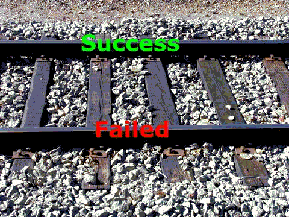

基于 RESTfull 服务集成的经验总结
================================

 - [说明](#abstract)
 - [事务化回退玩不转了](#rollback)
 - [幂等封装](#idempotent)
 - [轨道编程模式](#railway)
 - [延伸到Docker微服务组网](#macroservice)

---
2015/8/27 by wayne chan

<a name="abstract"></a>&nbsp;

说明
----

本文是对 **路标1阶段1** 工作进行总结，本阶段目标是在  github 上搭建立一套免费的博客系统，支持在线与离线两种编辑方式。现在用户按照 [pinp/software](https://github.com/pinp/software) 上的指示，可以自行创建个人博客了。写博客、发布博客的功能已做全，下阶段要增加的特性主要是：嵌入社交功能，如点赞、评论等。

Github 对外提供了一套不错的 API，其于 RESTful，功能完整，稳定性也较好，略嫌不足的是：调用 API 对 github 上的文件修改完成后，用 github.io 访问被修改页面，有时并不立即反映修改内容，其一，它设定了10分钟缓存，其二，触发 github.io 更新的事件有时会丢（这算是 github 的一个 BUG）。不过，这影响不大，可以规避，应该说，**在线内容更新并即时反馈** 的使用模式不是 github API 所预设的。

Github提供基于版本化文件的 RESTful 服务，如果按常规方式，用其 API 搭建在线编辑器，应该采用如下组网方式：

<iframe frameborder="0" border="0" width="550" height="160" src="$$/detail/?size=0x0&no-sidebar=1#2"></iframe>

在服务侧建立一个在线编辑服务，该服务应与 github.com  处于同一服务集群中，然后在本地的浏览器通过 “在线编辑服务” 实现博客在线编辑的功能。

但是，你无法把自己服务器移到 Github 的服务集群中。所以，只能采用如下方式：

<iframe frameborder="0" border="0" width="550" height="160" src="$$/detail/?size=0x0&no-sidebar=1#1"></iframe>

将基础服务（如 github 提供的文件操作），封装成高级服务（比如写博客），要集合多步（顺序或并发）基础操作。一个博客项目由多份文档组成，如 markdown 文件、图片、发行信息定义文件（$abstract.txt）等，要把基础服务的原子操作，组装成高级服务的原子操作，需要一定技巧。

上面两图反映的差别是：若在同一集群内组装基础操作是可靠的，但经internet远程连接的组装过程，会变得很不靠谱，各个步骤能否操作成功充满变数。如何让高级服务变稳健呢？下文有一些经验总结，另外，延伸到 **微服务组网** 场景，这些经验同样适用。

---

<a name="rollback"></a>&nbsp;

事务化回退玩不转了
------------------

原子操作视作一种事务，有独立性、完整性要求。构造原子化事务，大家容易想到的是回退机制，在事务起始时标记一下状态，事务执行中检测各项操作是否成功，不成功则提供回退，这一理念在数据库系统应用广泛。

但组装 RESTfull 基出 API 时，单靠回退是构造不出稳健服务的，因为，**回退操作并不比导致回退的操作更加可靠**。打个比方，[耗子兄](http://weibo.com/haoel)曾说过一段掌故，因安全需要，在服务器上安装安全监控，监控进程为了怕被干掉，于是启动两个进程互相守护，通过ps命令去探测对方，如果没有就启动对方进程。结果ps命令被误删掉了，守护进程看到不对方，就互启，进程数以2^n级增加，导致1000多台用户机器挂掉，强制重启都不管用。有网友评论：

> *为守护守护进程而创建了为守护守护进程的守护进程，又担心为守护守护进程的守护进程出问题，而建立了为守护守护进程的守护进程的守护进程，但是却因为为守护守护进程的守护进程的守护进程未能成功守护为守护守护进程的守护进程，导致守护守护进程的守护进程异常而未能守护进程的守护进程... *

拿我们的例子来说，发布一篇博客，要更新 $abstract.txt 与 config.json 两个文件，如果前一文件更改成功，后一个失败了，怎么办？如果按回退的思路，操作前先记录现场状态，当后一文件操作失败，你要回滚前一文件，回滚操作自身也需识别是否成功，如果回滚失败，是再试一次呢，还是报个警告后退出处理，如果选后者退出处理，下次操作怎么办？要接着先回滚吗？如果先回滚，上一次你是否要在服务器做个标记，问题又来了，做标记的操作失败了又怎么办？没完没了！而且，这里举例都是简单化处理的，失败有很多原因，业务逻辑冲突、服务器拒绝、通信失败等，要分开来处理，甚至有时，实际操作是成功的，但消息包返回时丢了，跑马拉松报信的兄弟半道上挂了，咋办？你都不知道当前这一步是不是也该纳入回退操作。

解决上述问题的思路是 **幂等封装**，而非事务回退。不妨延伸理解一下，Corba 与 SOAP技术能否解决这个？我相信这是两个层面的事，Corba 与 SOAP 一样无法解决 RESTful 接口集成问题。
 
---

<a name="idempotent"></a>&nbsp;

幂等封装
--------

这里不再解释幂等概念，大家自己 Google，RESTful 封装也讲幂等操作，比如 delete 某项资源，操作一次与操作多次是等效的。幂等封装强调的是操作结果要等效，而非过程内容完全一致。

比方说，成功更新 $abstract.txt 与 config.json 两个文件视作一种原子操作，操作失败可能残留信息，多次失败时每次残存信息可能都不一样，操作多次，只要最终成功，结果必然等效。如果失败后您意外退出或终止了，不再继续尝试，这时，**清理残存影响宜以运维的思路解决**，比如，软件另外提供清理、校验，或手动管理等功能。

做幂等封装时 **始终要考虑历史操作对本次操作可能产生的影响**，比如，两个文件要成对使用，一起创建，一起更改或删除，但如果遇到两者只存在一个，另一个缺失，肯定有问题，可能上次创建未完全成功，或上次没删完全，这时幂等封装要明确作出处理（自动处理优于报错）。再如，用 github API 保存一个文件要先知道它的 sha 值，sha 随文件版本而变化，若遇存盘失败，你要做标记，便于下次再次存盘时先查 sha 值，否则，一旦失败，你以为文件 sha 没变，但实际变了，程序仍用旧 sha 存盘，最终你的操作永远不会成功，挂那儿了。

---

<a name="railway"></a>&nbsp;

轨道编程模式
------------

把基础 RESTFull 封装成更高级服务，容易陷入 Callback hell，解决方法是采用 promise 方式写代码，promise 其实只一种编程风格，把嵌套在 N 层的代码拎到顶层来写，下面我们不用 promise 库，把代码写成这样，效果与 promise 等同。

<iframe frameborder="0" border="0" width="550" height="380" src="$$/detail/?size=0x0&no-sidebar=1#3"></iframe>

各步处理（如上面step 1 与 step 2）在顶层编码，最终结果区分成功（whenSucc）与失败（whenError），这两函数也在顶层编写，所以，整个处理逻辑很符合人类思考习惯。

尽管每一步 Ajax 调用是异步的，但各步串接是同步的。每个单步可能成功，也可能失败，就像两条铁轨，多步成功处理与失败处理串接一起，成为一条铁路，轨道编程模式因此命名。



上面代码可以优化一下，whenSucc 与 whenDone 合并，写成如下样子：

```
var whenDone = function(sErr) {
  if (sErr) {
    // ...
  } else {
    // ...
  }
};
```

两个函数之所以合并，因为结果处理，无论失败或成功，常有几段代码是相同的，在一个函数内编写更方便，另外，如果采用 promise 化描述也更方便。

---

<a name="macroservice"></a>&nbsp;

延伸到 Docker 微服务组网
----------------------

与传统服务相比，微服务将原有大服务分割，成为更小粒度的、原子化的服务，各个微服务独立运行在 Docker 上，成为一种自治单元，起停可以独立控制，版本升级也可独立进行。各微服务节点分散分布，同时对外又组装成大服务。这种情形与本文叙述的将基础 RESTful 拼装成高级服务是相通的，本文介绍的幂等封装、promise模型、轨道模式等一样适用。

用微服务构建一个站点，思维模式要从以往端到端服务，切换到 ROA （Resource-Oriented Architecture，面向资源架构）方式，ROA 并非 SOA 的对立面，但其思考问题方式确实与以往习惯有很大差异。等我们的探索活动深入些，有些实战经验后，再就微服务如何划分、如何管理等方面作总结，请持续关注本专题博客：<a target="_blank" href="https://best-practice.github.io/www/?opendoc=%2Fwww%2F%24%242015%2F%E5%AF%BB%E6%B1%82%E4%B8%80%E4%BD%93%E5%8C%96%E5%BC%80%E5%8F%91%E6%9C%80%E4%BD%B3%E5%AE%9E%E8%B7%B5.blog%2F">寻求前后端一体化开发的最佳实践</a>。

（完）

---
