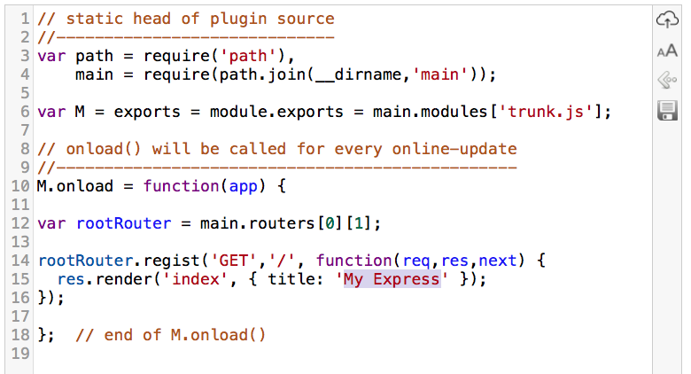

客户端与服务端一体化调测的最简形态
==================================

 - [一种秒级迭代的框架系统](#framework)
 - [实现原理](#howto)
 - [下一步演进](#nextstep)
 - [天朝码农的必杀技](#skill)

---
2015/9/17 by wayne chan

<a name="framework"></a>&nbsp;

秒级迭代的框架系统
------------------

在本系列活动（
<a target="_blank" href="https://best-practice.github.io/www/?opendoc=%2Fwww%2F%24%242015%2F%E5%AF%BB%E6%B1%82%E4%B8%80%E4%BD%93%E5%8C%96%E5%BC%80%E5%8F%91%E6%9C%80%E4%BD%B3%E5%AE%9E%E8%B7%B5.blog%2F">寻求前后端一体化开发的最佳实践</a>）一开始，就确定用 javascript 作为前后端一体化开发的统一语言。服务侧自然选 NodeJS，客户侧有如下几种供选择：

 1. 用 NodeJS 做开发，适用于命令行格式（无GUI界面）的产品
 2. 用网页（html5 + CSS3 + javascript）
 3. 用 node-webkit 做开发，当网页开发很受限制（如读写本地文件），用 NodeJS 又缺 GUI 界面时，或者，为了让你的程序用起来更 Native 一点，用 node-webkit 算是不错的选择。
 4. 既用网页做开发，也用 NodeJs 在本机启动一个 WebService。通常，大型应用才采用这种方式。

客户侧选择比较丰富，不幸的是，这 4 种情况在我的探索活动中都会遇到。每种情形都牵涉到客户端与服务端同时用 JS 编程，交叉着进行，为了让编程更具效率，我采用一种热插拔，在线更新运行逻辑的框架系统，让一次敏捷迭代过程缩短到 **秒级** 水平。

这个框架系统就是 **online-express**，已在 github 上开源：<a target="_blank" href="https://github.com/cse-soft/online-express">cse-soft/online-express</a>，本文围绕 online-express，介绍相关背景知识，揭示前因，描绘发展趋势。

---

<a name="howto"></a>&nbsp;

实现原理
--------

在远端启动一个用 NodeJS 开发的 WebService 程序，然后在本机打开一个源码编辑器（如下图），编辑服务侧的 JS 代码，每次编辑后按 ctrl + alt + s 热键，就把新代码更新到服务器，在浏览器访问远端 WebService，立即看到新修改产生的效果。想了解更多细节，请大家访问 github 上 cse-soft/online-express 的项目主页。



这种通过片断代码在线更新，来加速软件开发的做法，我已实践好多年了，最早在 Python 与 CSE 开发中实施，后来扩展到 NodeJS，越来越沉迷其中，现在遇到无法在线更新，不得不经常复位的场合，会觉得很难受。

下面是在 Python 中构造在线更新的核心逻辑，每次更新只须运行 `rerun(a_py_file)`。

```
def rerun(sFile):
  execfile(sFile,globals())
  return ''

print 'Use "rerun(sFile)" to renew, press "exit" to quit.'
s = raw_input('>>>')
while s != 'exit':
  try:
    compile(s,'__main__','eval')
    s = 'print ' + s
  except SyntaxError: pass

  try:  
    exec(s)
  except:
    import traceback
    traceback.print_exc()

  s = raw_input('>>>')
```

原理很简单，无非用 `execfile(a_py_file)` 动态读入一个 python 脚本文件立刻运行它。为了让每次执行都重用上次运行结果，编写这个源文件有特定要求，接下来马上介绍，与 NodeJS 中的处理是一样的。

在 NodeJS 中，导入一个源文件用 `require(a_js_file)`，对同一文件多次 `require`，结果是只执行一次的，为了让它多次执行，我们用一下黑科技，在 require 之前，运行这条语句：

 >  `delete require.cache[require.resolve(a_js_file)];`

先清缓存（`require.cache`）再require该文件就能再次读入并运行了。因为这个源文件要反复导入运行，我们希望每次运行，只更新某些函数的处理逻辑，前面已运行的结果，我们希望保留它，比如用到一个变量 `var myBuff = []`，之前已经往这个变量 `push` 一些数据了，再次导入时希望不要将它清空复位。这时，代码可以写成这样：

 > `var myBuff = M.myBuff = M.myBuff || [];`

这里 `M` 是当前模块对象，每次重新导入当前模块，这个 `M` 都重用历史旧值。

---

<a name="nextstep"></a>&nbsp;

下一步演进
----------

当前 online-express 的功能还比较简单，但对服务侧代码调测已够用了，出错时能打印调用栈，报错信息具体到哪个文件哪一行，用起来还是比较舒服的。

不妨对照一下 Meteor 的在线更新模式，客户端代码与服务端代码写在一起，比如：

```
// common
Posts = new Mongo.Collection("posts");

// client-side
Meteor.subscribe("posts");

// server-side
Meteor.publish("posts", function(limit) {
  return Posts.find({
    user_id: this.userId
  });
});
```

将来我们怎么支持这种形式呢？很简单，服务侧与客户侧都有 `Meteor` 对象，但服务侧定义的 `Meteor.subscribe()` 是空函数，`Meteor.publish()` 则有具体处理。如果是客户侧就反过来，`Meteor.publish()` 是空函数，`Meteor.subscribe()` 有处理。这样，同一份代码在客户侧与服务侧都能跑了。现在 online-express 的服务侧能自动更新了，再让客户侧也支持自动更新，Meteor 那种前后端 **即时改即时调** 的机制不就实现了吗。

今后 online-express 将发展成一个集成IDE（可能到时不叫 online-express 了），基础原理还一样，编辑器会更好用，有提示输入什么的。另外，借助 docker 技术，搭建环境变得异常简单，比如：在 AWS 云计算环境中，拖一个 dockerfile 启动它，然后客户端（浏览器）与之连接就可以编程了，服务端与客户端代码在一个 IDE 中同时搞掂。

---

<a name="skill"></a>&nbsp;

天朝码农的必杀技
----------------

自从帝都进入阅兵蓝，天朝开始步入 **网络黑** 年代，与年初那波墙不同，年初开始让你不翻 Q 难以访问外部世界，进入网络黑后，即使翻 Q 也很难访问。就个人亲身体验而言，不翻 Q，AWS 的控制台己经连不上了，翻了 Q，也只是白天工作时段能用，即便如此，`https GET` 平均时延超过 5 秒（非工作时段时延更是高得离谱），这意味着什么？你再也不能按官方推荐的方式去调试了，AWS 官方推荐在本地启动程序，通过远程访问 S3、DB 等搭建调测环境，如果一次服务（打开网页）要涉及 10 多次 AWS API 调用（这很常见），各次 API 还是串行的，如果还在本地调测，要2分钟才能打开一个网页，**天哪！还给不给活路了**。

没有活路，但我还活着，因为我用的是 online-express。在墙外真实开启你的 EC2 实例，然后随时在线更新代码，让你的调测持续进行，如果没有在线代码更新，就不得不反复提交版本并重起服务器，AWS 一次重新布署约耗时 3 分钟，将生命消耗在这种无谓等待上，非常不值。

或许有人会问，为什么不用北京区的 AWS？好吧，我要用的 ECS、Lambda、Route53、CodeCommit、CodeDeploy、ApiGateway，北京区全部缺失，AWS 在天朝用的基本是5年前的技术，但与国内云计算公司对垒基本够了。如果你不想折腾过气技术，还是老老实实翻 Q 吧。 

（完）

---
